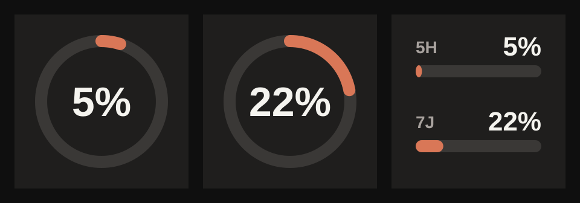
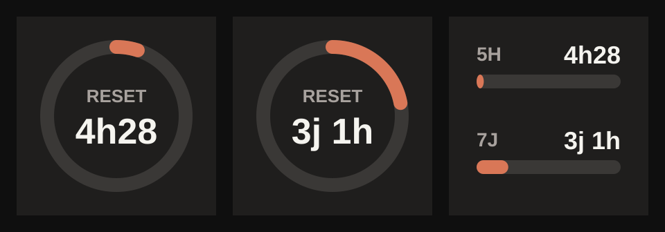

# Claude Usage pour OpenDeck

[English](README.md)

Plugin [OpenDeck](https://github.com/nekename/OpenDeck) qui affiche le pourcentage d'utilisation de ton abonnement Claude (Pro / Max) sur une touche de Stream Deck.



Un appui sur la touche affiche le temps restant avant la remise à zéro :



> **Non affilié à Anthropic.** Plugin communautaire non officiel. Il utilise un endpoint non documenté de Claude Code, qui peut changer ou cesser de fonctionner à tout moment.

## Fonctionnalités

- Anneau avec le pourcentage d'utilisation, coloré selon le niveau (orange, puis jaune à 70 %, puis rouge à 90 %)
- Choix par touche : session 5 h, hebdomadaire, les deux, hebdo Opus ou hebdo Sonnet
- Appui : affiche le temps avant le reset pendant 5 secondes et rafraîchit les données
- Rafraîchissement automatique toutes les minutes
- Aucune dépendance : un seul fichier Node.js

## Prérequis

- **Linux** (macOS et Windows pas encore supportés, voir plus bas)
- [OpenDeck](https://github.com/nekename/OpenDeck)
- **Node.js ≥ 22** (pour `WebSocket` et `fetch` natifs). Le lanceur cherche `node` dans le `PATH`, dans [mise](https://mise.jdx.dev) ou dans nvm.
- [Claude Code](https://claude.com/claude-code) connecté avec ton compte Claude (`claude` puis `/login`)

## Installation

1. Télécharge `com.verso.claudeusage.sdPlugin.zip` depuis la page [Releases](../../releases).
2. Décompresse-le dans le dossier des plugins OpenDeck :
   ```sh
   unzip com.verso.claudeusage.sdPlugin.zip -d ~/.config/opendeck/plugins/
   ```
3. Redémarre OpenDeck, puis glisse l'action **Claude → Utilisation Claude** sur une touche.

### Depuis les sources

```sh
git clone https://github.com/lilian-17/opendeck-claude-usage.git
ln -s "$PWD/opendeck-claude-usage/com.verso.claudeusage.sdPlugin" ~/.config/opendeck/plugins/
```

## Fonctionnement et confidentialité

Le plugin lit le jeton OAuth que Claude Code enregistre dans `~/.claude/.credentials.json` (ou `$CLAUDE_CONFIG_DIR/.credentials.json`) et appelle `https://api.anthropic.com/api/oauth/usage`, l'endpoint qu'utilise Claude Code pour `/usage`.

- Le jeton est **envoyé uniquement à `api.anthropic.com`**. Rien n'est envoyé ailleurs, rien n'est écrit sur le disque.
- Le plugin **ne renouvelle jamais le jeton** lui-même, pour ne pas perturber la session de Claude Code. S'il a expiré, la touche affiche `TOKEN EXPIRÉ` : il suffit de lancer `claude` une fois pour le renouveler.
- Toute la logique est dans [`plugin.js`](com.verso.claudeusage.sdPlugin/plugin.js) (~200 lignes). N'hésite pas à le lire.

## Limites

- **macOS** : Claude Code range ses identifiants dans le Trousseau, pas dans un fichier. Pas encore supporté.
- **Windows** : le lanceur est un script bash. Pas encore supporté.
- Endpoint non documenté : si Anthropic le modifie, le plugin cassera jusqu'à sa mise à jour.

Les contributions sont bienvenues.

## Construire une release

```sh
./package.sh   # → dist/com.verso.claudeusage.sdPlugin.zip
```

## Licence

[MIT](LICENSE)
